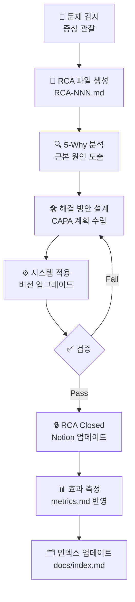

# 🔧 RCA/CAPA 허브

> **경로**: `docs/rca-capa/` | **관리자**: Gilbert Kwak | **버전**: v2.0 | **업데이트**: 2026-04-09

[](../index.md)
[](https://www.notion.so/33d55ed436f081bfa2aeccc26f344de5)
[]
[]

이 디렉토리는 프롬프트 엔지니어링 시스템에서 발생한 모든 문제의 **근본 원인 분석(RCA)** 및 **시정 및 예방 조치(CAPA)** 를 관리합니다.

---

## 📋 RCA 등록부 (Registry)

| ID | 제목 | 증상 | 근본 원인 | 해결 버전 | 상태 | Notion |
|----|------|------|---------|---------|------|--------|
| [RCA-001](./RCA-001.md) | 프롬프트 구조 복잡도 | 에이전트 실행 불가 | XML 중첩 과다·파싱 기준 미정의 | v3.0 | ✅ Closed | [링크](https://www.notion.so/33d55ed436f081c593ede0347d2b581a) |
| [RCA-002](./RCA-002.md) | 검증 기준 모호성 | 결과 재현 불가 | 스코어링 정량 기준 부재 | v3.1 | ✅ Closed | [링크](https://www.notion.so/33d55ed436f081d0a7a1d4a2a8de4a8f) |
| [RCA-003](./RCA-003.md) | 필수 고려사항 누락 | 실행 위험 발생 | RISK 에이전트 규제·데이터 축 미정의 | v3.1 | ✅ Closed | [링크](https://www.notion.so/33d55ed436f0817e83e0f3bc0f168316) |
| [RCA-004](./RCA-004.md) | 중복 출력 과다 | 응답 과부하 | Orchestrator 역할 범위 미정의 | v3.1 | ✅ Closed | [링크](https://www.notion.so/33d55ed436f08195bd49cdd19f062644) |

> 신규 RCA 등록 시: `RCA-NNN.md` 파일 생성 → 이 표에 행 추가 → Notion Child 페이지 연동

---

## 🔄 CAPA 워크플로우



---

## 📁 RCA 파일 표준 포맷

각 `RCA-NNN.md` 파일은 아래 섹션을 반드시 포함합니다:

```markdown
## 메타데이터
- ID / 제목 / 발견 날짜 / 담당자 / 상태 / 해결 버전

## 1. 증상 (Symptom)
## 2. 직접 원인 (Direct Cause)
## 3. 근본 원인 (Root Cause) — 5-Why
## 4. 해결 방안 (Corrective Action)
## 5. 예방 조치 (Preventive Action)
## 6. 검증 결과 (Verification)
## 7. Notion 연동 링크
```

---

## ✅ 신규 RCA 등록 체크리스트

- [ ] `RCA-NNN.md` 파일 생성 (번호 순서 유지)
- [ ] 표준 포맷 7개 섹션 작성
- [ ] 이 README 등록부 표에 행 추가
- [ ] `docs/index.md` RCA 테이블 업데이트
- [ ] Notion Child 페이지 생성 및 양방향 링크 연동
- [ ] `CHANGELOG.md`에 버전 이력 기록
- [ ] 해결 후 상태를 `✅ Closed`로 변경

---

## 📈 RCA 통계 요약

| 항목 | 수치 |
|------|------|
| 전체 등록 RCA | 4건 |
| Closed | 4건 |
| Open | 0건 |
| 평균 해결 기간 | ~3일 |
| 연동 Notion 페이지 | 4건 |

---

> 관련 문서: [Master Index](../index.md) | [Notion RCA Hub](https://www.notion.so/33d55ed436f081bfa2aeccc26f344de5) | [CHANGELOG](../../CHANGELOG.md)
